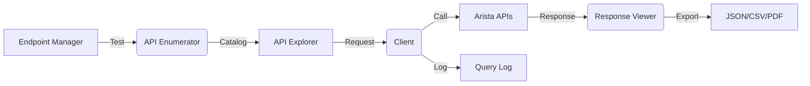

# ⚡ Arista Engine
*A Cyberpunk-Themed Arista Networks API GUI (Go + Wails)*


---

## 🚀 Overview

**Arista Engine** is a **standalone GUI application for exploring and managing the full Arista Networks API ecosystem**, including:

- **Arista eAPI (EOS command API)**  
- **Arista CloudVision APIs (gRPC + REST)**  
- **EOS Management APIs (telemetry, streaming, resources)**  

Built with **Go (backend)** and **Wails (desktop/webview UI)**, the engine provides a **cyberpunk neon cockpit** where network engineers can browse, query, and export **the entire documented API surface** without needing to memorize endpoints.

Key capabilities:
- **Automatic API Enumeration**: pulls the full list of available endpoints from Arista docs/metadata.  
- **Connection Testing** (reachability, TLS posture, authentication).  
- **API Explorer** with JSON editor and endpoint autocomplete.  
- **Response Viewer** (Table, JSON, Raw).  
- **Export system** (JSON, CSV, PDF).  
- **Safe policy mode** to restrict destructive operations.  

---

## ✨ Features

### 🔑 Endpoint Management
- Add, edit, delete Arista devices or controllers.  
- Save **URL, token, TLS mode, tags**.  
- Credentials encrypted at rest.  

### 🔍 Connection Testing
- Validate API URL & TLS.  
- Test token authentication.  
- Fetch metadata: EOS version, platform, CloudVision cluster info.  

### 🧩 Full API Enumeration
- Automatic discovery of all supported API endpoints.  
- Categorized by **eAPI**, **CloudVision REST**, **CloudVision gRPC**, **Streaming APIs**.  
- Searchable catalog with descriptions, methods, and schemas.  

### 🧪 API Explorer
- Endpoint dropdown with autocomplete from **enumerated API catalog**.  
- Choose HTTP method (GET/POST/PUT/DELETE).  
- JSON editor for body input.  
- Prebuilt templates for common operations.  

### 📊 Response Viewer
- **Table View**: parse structured JSON to neon grid.  
- **JSON View**: syntax-highlighted glowing editor.  
- **Raw View**: plain text body.  

### 📤 Exports & Logging
- Export results → **JSON, CSV, PDF**.  
- Each API request and response stored in a query log.  
- Optional audit trail for compliance.  

---

## 🏗️ Architecture

```
arista-engine/
├─ cmd/
│  └─ arista_engine/          # app entrypoint (Wails bootstrap)
├─ internal/
│  ├─ client/                 # HTTP client, retries, connection tests
│  ├─ core/                   # domain models, API catalog, request log
│  ├─ enum/                   # full API enumeration + schema discovery
│  ├─ store/                  # persistence (BoltDB/SQLite)
│  ├─ uiapi/                  # Go <-> Frontend bindings
│  └─ util/                   # helpers (export, logging, csv/pdf)
├─ ui/                        # frontend (Wails): Svelte/React/Vue
│  ├─ src/
│  └─ package.json
├─ configs/
│  └─ templates.json          # command templates
└─ README.md
```

**Flow**  
1. Add endpoint (URL + token).  
2. Connection test runs.  
3. Full API surface enumerated (endpoints pulled into catalog).  
4. Explorer lets you query any endpoint directly.  
5. Responses displayed in Table/JSON/Raw.  
6. Export results to JSON/CSV/PDF.  

---

## 📜 Data Models

**Endpoint Config**

```go
type Endpoint struct {
    ID        string   `json:"id"`
    Name      string   `json:"name"`
    URL       string   `json:"url"`
    Token     string   `json:"token"`
    TLSMode   string   `json:"tlsMode"`   // strict, hybrid, plain
    Tags      []string `json:"tags"`
    CreatedBy string   `json:"createdBy"`
    Created   time.Time`json:"created"`
}
```

**API Catalog Entry**

```go
type APIDefinition struct {
    ID          string   `json:"id"`
    Service     string   `json:"service"`   // eapi, cloudvision, telemetry
    Method      string   `json:"method"`    // GET/POST/PUT/DELETE
    Path        string   `json:"path"`
    Description string   `json:"description"`
    Params      []string `json:"params"`
}
```

**API Query Record**

```go
type APIQueryRecord struct {
    ID         string                 `json:"id"`
    EndpointID string                 `json:"endpointId"`
    Method     string                 `json:"method"`
    Path       string                 `json:"path"`
    Body       map[string]any         `json:"body,omitempty"`
    Status     int                    `json:"status"`
    Response   map[string]any         `json:"response"`
    Timestamp  time.Time              `json:"timestamp"`
}
```

---

## 🎨 UI / UX

### Endpoint Manager
* Neon table of endpoints with connection status.
* Status: ✅ Connected | ⚠️ Warning | ❌ Failed.

### API Catalog
* Full list of all enumerated APIs.
* Filter by service (eAPI, CloudVision, Telemetry).
* Click to load into Explorer.

### API Explorer
* Endpoint dropdown.
* Method selector.
* Path input (autocomplete from catalog).
* JSON body editor.
* Run button (cyan glow).

### Response Viewer
* **Table Tab**: parsed structured data.
* **JSON Tab**: glowing syntax highlight.
* **Raw Tab**: raw text stream.

### Export
* Buttons: JSON | CSV | PDF.

---

## 🔒 Security & Policy

* Credentials encrypted locally.
* TLS validation enforced by default.
* Optional **policy rules** to block dangerous calls:

```toml
[[rules]]
id = "deny-config-push"
resource = "arista.api"
action = "exec"
when = { path="/command-api", bodyContains="configure terminal" }
effect = "deny"
```

---

## ⚙️ Installation

### Prerequisites

* **Go 1.22+**
* **Node.js 18+**
* **Wails v2 CLI** (`go install github.com/wailsapp/wails/v2/cmd/wails@latest`)

### Build

```bash
git clone https://github.com/<your-org>/arista-engine.git
cd arista-engine

cd frontend && npm install && cd ..
wails build
```

### Run in Dev Mode

```bash
wails dev
```

---

## 🛠️ Usage

1. Launch **Arista Engine**.
2. Add an API endpoint (URL, token).
3. Run **Connection Test**.
4. Browse **full API catalog** (enumerated endpoints).
5. Run API calls via Explorer.
6. View results in Table/JSON/Raw.
7. Export results to JSON/CSV/PDF.

---

## 📅 Roadmap

* [x] Endpoint management.
* [x] Connection testing.
* [x] Full API enumeration (eAPI + CloudVision + Telemetry).
* [x] Rich Explorer with autocomplete.
* [x] Response Viewer tables for common schemas.
* [ ] Export (JSON/CSV/PDF).
* [ ] Policy enforcement.
* [ ] Command templates system.
* [ ] Comprehensive logging and audit trail.

---

## 🧭 High-Level Flow



---

## 📄 License

MIT License — free to use, modify, and distribute.

---

## ⚡ Closing Note

**Arista Engine** is designed to **map, browse, and interact with the entire Arista API surface** in a single neon-themed cockpit.
*Discover everything. Test anything. Export anywhere.*

---

## 🎨 Design Philosophy

The application features a **cyberpunk aesthetic** with:
- **Dark background** (#1a1a1a) for reduced eye strain
- **Vivid pink accents** (#ff00ff) for primary actions and highlights
- **Hot pink** (#ff69b4) for secondary elements
- **Deep pink** (#ff1493) for accent colors
- **Glowing effects** and **neon borders** for that authentic cyberpunk feel
- **Monospace fonts** for technical data display
- **Grid-based layouts** for organized information display

The design is inspired by classic cyberpunk interfaces while maintaining excellent usability and accessibility.
